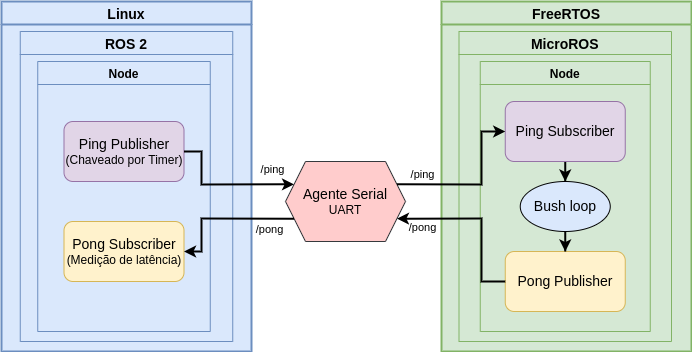
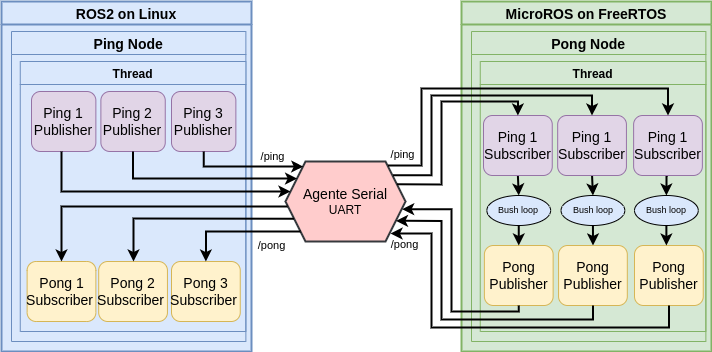

# MicroROS with ROS2 Benchmarking

MicroROS and ROS 2 push communication benchmarking.

---

## Experiments

  

### Single Thread Executor -- 1 topic

  
  

### Single Thread Executor -- 3 topics

  

### Multi Thread Executor -- 3 topics

Callback group for each topic callback